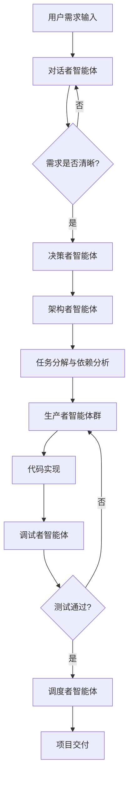
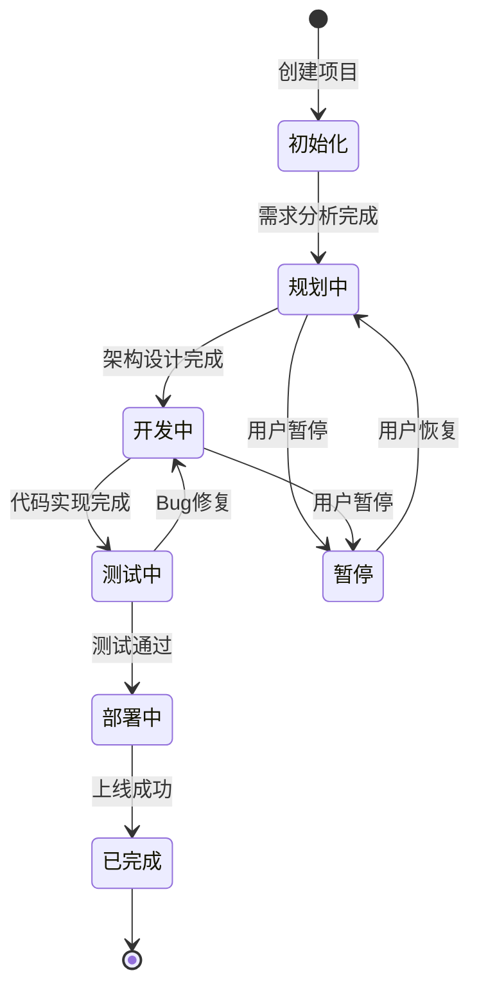
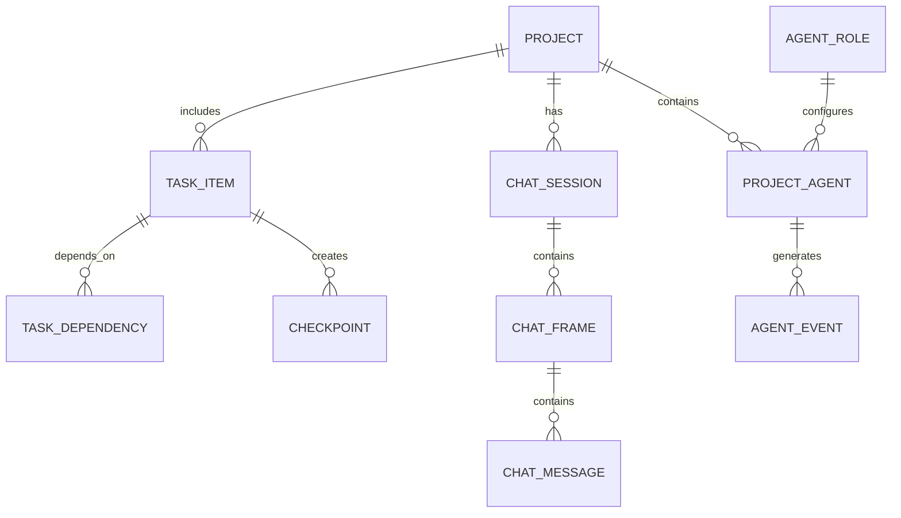

# OpenStaff 多智能体软件开发平台 - 产品需求文档 (PRD)

## 📋 文档信息

| 项目 | 信息 |
|------|------|
| **项目名称** | OpenStaff - 多智能体协作软件开发平台 |
| **版本** | 1.0.0 |
| **文档类型** | 产品需求文档 (PRD) |
| **创建日期** | 2025年4月5日 |
| **目标用户** | 软件开发团队、独立开发者、技术初创公司 |
| **核心价值** | 通过AI智能体团队协作，自动化完成从需求到代码交付的全流程 |

---

## 🎯 项目愿景与目标

### **愿景陈述**
OpenStaff 旨在成为全球首个真正自主的多智能体软件开发平台，让软件开发像搭积木一样简单高效，使任何有想法的人都能将其转化为可运行的软件产品。

### **核心目标**
1. **自动化率**：实现70%以上的软件开发流程自动化
2. **协作效率**：通过智能体协作提升开发效率5-10倍
3. **代码质量**：确保生成的代码符合行业最佳实践和安全标准
4. **可扩展性**：支持从小型项目到企业级应用的各种规模
5. **易用性**：让非技术背景的用户也能参与软件开发过程

---

## 👥 目标用户画像

### **主要用户群体**

#### **1. 技术初创公司**
- **特征**：团队规模2-10人，需要快速验证产品想法
- **痛点**：开发资源有限，时间压力巨大，多角色协作成本高
- **需求**：快速原型开发，多技术栈支持，成本效益优化

#### **2. 独立开发者**
- **特征**：一个人或小团队，需要处理全栈开发
- **痛点**：精力分散，需要同时关注多个技术领域
- **需求**：智能助手分担工作，代码审查，自动化测试

#### **3. 企业开发团队**
- **特征**：组织架构复杂，多项目并行开发
- **痛点**：沟通成本高，知识管理困难，代码一致性维护
- **需求**：团队协作优化，知识沉淀，标准化流程

#### **4. 教育培训机构**
- **特征**：需要教学软件开发流程
- **痛点**：理论与实践结合困难，学生实践机会有限
- **需求**：可视化开发流程，智能辅导，学习效果评估

---

## 🚀 核心功能需求

### **1. 智能体协作系统**

#### **1.1 智能体角色体系**

| 智能体角色 | 英文标识 | 核心职责 | 关键能力 |
|-----------|----------|----------|----------|
| **对话者** | communicator | 需求理解与澄清 | 自然语言理解、交互式问答、需求文档生成 |
| **决策者** | decision_maker | 技术方案评估 | 架构设计决策、技术栈选择、成本效益分析 |
| **架构者** | architect | 系统架构设计 | 任务分解、依赖分析、模块化设计 |
| **生产者** | producer | 代码生成实现 | 代码生成、文件操作、Git管理、API设计 |
| **调试者** | debugger | 质量保证 | 测试用例编写、Bug诊断、性能优化建议 |
| **图片创造者** | image_creator | UI资源生成 | 图标设计、界面素材、可视化图表 |
| **视频创造者** | video_creator | 多媒体内容 | 演示视频、教程制作、产品展示 |
| **调度者** | orchestrator | 中央协调 | 任务路由、智能体调度、进度监控 |

#### **1.2 协作流程设计**



#### **1.3 智能体通信协议**

- **消息格式**：标准化JSON消息格式
- **路由机制**：基于标记的自动路由
- **上下文传递**：项目级上下文共享与隔离
- **错误处理**：异常重试、降级策略、人工干预触发

### **2. 项目管理系统**

#### **2.1 项目生命周期管理**



#### **2.2 任务管理功能**

- **任务分解**：自动将用户需求分解为可执行的技术任务
- **依赖管理**：任务间依赖关系图可视化
- **优先级排序**：基于依赖关系和资源可用性的智能排序
- **进度跟踪**：实时任务执行状态与耗时分析
- **里程碑管理**：关键节点设置与达成提醒

#### **2.3 看板与监控**

- **项目仪表板**：整体进度、资源使用、风险预警
- **任务看板**：Kanban风格的任务状态可视化
- **智能体状态监控**：各智能体工作负载与性能指标
- **实时协作流**：智能体间对话过程实时展示

### **3. 代码生成与管理系统**

#### **3.1 智能代码生成**

- **多语言支持**：JavaScript/TypeScript、Python、Java、C#、Go等
- **框架适配**：React、Vue、Angular、Spring、Django、.NET等
- **代码模板**：行业最佳实践代码模板库
- **代码质量保证**：自动化代码审查、安全性检查

#### **3.2 版本控制集成**

- **Git集成**：自动提交、分支管理、冲突解决
- **代码审查**：Pull Request自动生成与审查
- **回滚机制**：检查点管理，一键回滚到任意版本
- **多人协作**：团队协作权限管理

#### **3.3 文件管理**

- **项目结构生成**：符合行业标准的目录结构
- **配置文件管理**：自动化配置文件生成与维护
- **资源文件管理**：图片、样式、脚本等资源组织
- **依赖管理**：包管理器集成

### **4. 质量保证系统**

#### **4.1 自动化测试**

- **单元测试**：自动生成单元测试用例
- **集成测试**：API测试、数据库集成测试
- **端到端测试**：用户场景模拟测试
- **性能测试**：负载测试、压力测试

#### **4.2 代码质量分析**

- **静态代码分析**：代码规范检查、复杂度分析
- **安全漏洞扫描**：常见安全问题检测
- **性能分析**：代码性能瓶颈识别
- **技术债务跟踪**：代码改进建议优先级排序

### **5. 用户界面系统**

#### **5.1 Web前端界面**

- **项目管理界面**：项目列表、详情、设置
- **对话协作界面**：类似ChatGPT的对话式交互
- **任务管理界面**：任务列表、看板视图、甘特图
- **代码审查界面**：代码diff可视化、评论功能
- **监控仪表板**：实时数据可视化图表

#### **5.2 交互设计**

- **实时通知**：WebSocket实时推送
- **进度可视化**：进度条、状态图标、动画效果
- **快捷操作**：常用功能快捷键支持
- **主题定制**：暗色/亮色主题、个性化设置

### **6. 扩展插件系统**

#### **6.1 插件架构**

- **自定义智能体**：第三方可开发专用智能体
- **自定义工具**：扩展智能体能力的工具插件
- **集成插件**：与第三方服务集成的插件
- **主题插件**：UI主题和布局定制

#### **6.2 插件市场**

- **插件发现**：官方插件市场
- **插件管理**：安装、卸载、更新、配置
- **开发者支持**：插件开发工具包、文档、示例

---

## ⚙️ 非功能需求

### **1. 性能需求**

| 指标 | 目标值 | 测量方法 |
|------|--------|----------|
| **响应时间** | API响应 < 200ms | 性能监控 |
| **并发处理** | 支持100+项目同时运行 | 负载测试 |
| **代码生成速度** | 1000行/分钟 | 基准测试 |
| **系统可用性** | 99.5% uptime | 运维监控 |

### **2. 安全需求**

- **数据加密**：敏感数据AES-256加密存储
- **访问控制**：基于角色的权限管理(RBAC)
- **API安全**：JWT认证、请求签名验证
- **代码安全**：生成代码安全性扫描
- **审计日志**：操作日志完整记录

### **3. 可扩展性需求**

- **水平扩展**：支持分布式部署
- **插件扩展**：支持第三方插件开发
- **智能体扩展**：支持自定义智能体角色
- **API扩展**：提供完整的RESTful API

### **4. 兼容性需求**

- **浏览器兼容**：Chrome、Firefox、Safari、Edge最新版本
- **操作系统**：Windows、macOS、Linux
- **移动端**：响应式设计，支持平板访问
- **数据库**：PostgreSQL、MySQL、SQLite

---

## 📊 数据模型设计

### **核心实体关系**



### **数据字典**

#### **Project (项目)**
- `id`: 唯一标识符
- `name`: 项目名称
- `description`: 项目描述
- `tech_stack`: 技术栈配置(JSON)
- `language`: 开发语言偏好
- `status`: 项目状态
- `workspace_path`: 工作空间路径
- `metadata`: 扩展元数据

#### **AgentRole (智能体角色)**
- `id`: 唯一标识符
- `role_type`: 角色类型标识
- `name`: 显示名称
- `description`: 功能描述
- `system_prompt`: 系统提示词
- `model_name`: 使用的AI模型
- `config`: 角色配置(JSON)

#### **TaskItem (任务项)**
- `id`: 唯一标识符
- `project_id`: 所属项目
- `title`: 任务标题
- `description`: 详细描述
- `status`: 执行状态
- `priority`: 优先级(1-10)
- `assigned_agent_id`: 分配的智能体
- `parent_task_id`: 父任务ID

---

## 🔌 API设计规范

### **RESTful API设计**

#### **项目管理API**
```
POST   /api/projects                    # 创建项目
GET    /api/projects                    # 获取项目列表
GET    /api/projects/{id}               # 获取项目详情
PUT    /api/projects/{id}               # 更新项目
DELETE /api/projects/{id}               # 删除项目
POST   /api/projects/{id}/initialize    # 初始化项目
POST   /api/projects/{id}/export        # 导出项目
POST   /api/projects/import             # 导入项目
```

#### **智能体交互API**
```
POST   /api/sessions                    # 创建对话会话
GET    /api/sessions/{id}               # 获取会话详情
POST   /api/sessions/{id}/cancel        # 取消会话
GET    /api/sessions/{id}/events        # 获取会话事件
POST   /api/agents/{id}/message         # 发送消息给智能体
GET    /api/agents/{id}/status          # 获取智能体状态
```

#### **任务管理API**
```
GET    /api/projects/{id}/tasks         # 获取项目任务列表
POST   /api/projects/{id}/tasks         # 创建任务
PUT    /api/tasks/{id}                  # 更新任务状态
GET    /api/tasks/{id}/dependencies     # 获取任务依赖
```

### **SignalR实时通信API**

```javascript
// 连接到通知中心
const connection = new HubConnectionBuilder()
    .withUrl("/hubs/notification")
    .build();

// 订阅项目通知
connection.on("project_updated", (project) => {
    console.log("Project updated:", project);
});

// 订阅会话事件
connection.on("session_event", (event) => {
    console.log("Session event:", event);
});
```

---

## 🎨 用户界面设计规范

### **1. 界面布局原则**

- **响应式设计**：适配桌面、平板设备
- **模块化布局**：可拖拽、可配置的界面组件
- **信息密度**：平衡信息展示与视觉舒适度
- **色彩系统**：基于Ant Design色彩规范

### **2. 关键界面设计**

#### **项目仪表板**
```
┌─────────────────────────────────────────────────────────────┐
│  OpenStudio                    [搜索框]    [通知] [用户]     │
├─────────────────────────────────────────────────────────────┤
│  [项目列表]  [任务看板]  [智能体状态]  [代码审查]          │
├─────────────────────────────────────────────────────────────┤
│                                                               │
│  项目概览                                                      │
│  ┌─────┐  ┌─────┐  ┌─────┐  ┌─────┐                       │
│  │ 总数 │  │ 进行中│  │ 完成 │  │ 延期 │                       │
│  │ 12  │  │  5   │  │  6   │  │  1   │                       │
│  └─────┘  └─────┘  └─────┘  └─────┘                       │
│                                                               │
│  最近活动                                                     │
│  • 架构者完成了用户模块设计                                    │
│  • 生产者生成了API接口代码                                     │
│  • 调试者发现了3个潜在问题                                    │
│                                                               │
└─────────────────────────────────────────────────────────────┘
```

#### **对话协作界面**
```
┌─────────────────────────────────────────────────────────────┐
│  项目：电商平台开发        [返回] [暂停] [设置]              │
├──────────────────────┬──────────────────────────────────────┤
│  智能体协作区          │  对话历史                          │
│  ┌──────────────────┐│  ┌────────────────────────────────┐│
│  │ 对话者 💬        ││  │ 用户: 我需要一个电商平台      ││
│  │ 状态: 活跃       ││  │ 对话者: 请问您希望支持什么    ││
│  └──────────────────┘│  │         支付方式？            ││
│  ┌──────────────────┐│  │ 用户: 微信和支付宝            ││
│  │ 决策者 🧠        ││  │ 决策者: 好的，我推荐使用...  ││
│  │ 状态: 等待中     ││  │                               ││
│  └──────────────────┘│  │ [输入框]                     [发送]││
│  ┌──────────────────┐│  └────────────────────────────────┘│
│  │ 架构者 📐        ││                                      │
│  │ 状态: 活跃       ││  任务进度                           │
│  └──────────────────┘│  ┌────────────────────────────────┐│
│  ┌──────────────────┐│  │ ████░░░░░░ 用户模块 80%       ││
│  │ 生产者 💻        ││  │ ████████░░░ 订单模块 85%      ││
│  │ 状态: 忙碌       ││  │ ███░░░░░░░░ 支付模块 35%       ││
│  └──────────────────┘│  └────────────────────────────────┘│
└──────────────────────┴──────────────────────────────────────┘
```

---

## 🔐 安全与合规需求

### **1. 数据安全**

- **数据加密**：敏感数据传输和存储加密
- **备份策略**：每日自动备份，异地容灾
- **隐私保护**：符合GDPR、个人信息保护法要求
- **访问审计**：完整的操作日志记录

### **2. 代码安全**

- **安全扫描**：集成安全漏洞扫描工具
- **依赖检查**：第三方库安全漏洞检测
- **密钥管理**：API密钥安全管理
- **权限控制**：细粒度的访问权限控制

### **3. 业务合规**

- **开源协议**：生成代码的许可证管理
- **知识产权**：代码所有权和使用权明确
- **合规审查**：行业特定合规要求检查

---

## 📈 性能与监控需求

### **1. 系统监控指标**

- **资源使用率**：CPU、内存、磁盘、网络
- **业务指标**：项目完成率、代码生成量、用户活跃度
- **性能指标**：响应时间、吞吐量、错误率
- **用户体验**：界面加载时间、操作响应速度

### **2. 日志与诊断**

- **应用日志**：结构化日志，分级记录
- **性能日志**：关键操作耗时分析
- **错误日志**：异常详细信息记录
- **审计日志**：用户操作完整记录

---

## 🚢 部署与运维需求

### **1. 部署方式**

- **本地部署**：单机Docker Compose部署
- **云端部署**：支持AWS、Azure、阿里云等云平台
- **混合部署**：本地开发、云端生产
- **私有化部署**：企业内网部署方案

### **2. 容器化要求**

- **镜像管理**：Docker镜像版本管理
- **编排工具**：Kubernetes、Docker Compose支持
- **弹性伸缩**：基于负载的自动扩容
- **健康检查**：容器健康状态监控

### **3. 配置管理**

- **环境配置**：开发、测试、生产环境分离
- **配置中心**：集中化配置管理
- **敏感信息**：密钥、密码等安全存储
- **配置验证**：启动时配置有效性检查

---

## 🎯 成功指标(KPI)

### **用户参与度指标**
- 月活跃用户数(MAU)
- 平均会话时长
- 功能使用频率分布
- 用户留存率

### **业务效果指标**
- 项目完成率
- 代码生成质量(通过编译的比例)
- 开发效率提升倍数
- 用户满意度评分

### **技术性能指标**
- 系统响应时间
- API成功率
- 系统可用性(SLA达成率)
- 资源利用率

---

## 🗺️ 产品路线图

### **Phase 1: 核心功能 (MVP) - 3个月**
- ✅ 基础智能体框架
- ✅ 项目管理功能
- ✅ 代码生成能力
- ✅ 基础用户界面

### **Phase 2: 协作增强 - 2个月**
- 🔄 实时协作功能
- 🔄 团队权限管理
- 🔄 代码审查流程
- 🔄 插件系统基础

### **Phase 3: 智能升级 - 3个月**
- ⏳ AI能力优化
- ⏳ 自动化测试完善
- ⏳ 性能优化建议
- ⏳ 智能推荐系统

### **Phase 4: 生态建设 - 持续**
- ⏳ 插件市场
- ⏳ 开发者社区
- ⏳ 企业版功能
- ⏳ 移动端应用

---

## 💡 创新亮点

### **1. 多智能体协作范式**
- 首个真正实现AI智能体团队协作的开发平台
- 模拟真实开发团队的角色分工和协作流程

### **2. 全流程自动化**
- 从需求理解到代码部署的全链路自动化
- 大幅降低软件开发的技术门槛

### **3. 学习型系统**
- 智能体可以从项目中学习最佳实践
- 持续优化代码质量和开发效率

### **4. 低代码+AI融合**
- 结合低代码平台的易用性和AI的智能化
- 为不同技术水平的用户提供适配的交互方式

---

## 📚 附录

### **A. 术语表**
- **智能体(Agent)**: 具有自主决策能力的AI软件实体
- **调度者(Orchestrator)**: 负责协调其他智能体的中央智能体
- **任务(Task)**: 可执行的开发任务单元
- **检查点(Checkpoint)**: 项目状态快照，用于版本管理

### **B. 参考文档**
- Microsoft Agent Framework文档
- .NET Aspire架构指南
- EF Core数据库设计最佳实践

### **C. 技术栈总览**
- **后端**: .NET 10, C#, ASP.NET Core, SignalR
- **数据库**: PostgreSQL 16, Entity Framework Core
- **前端**: Vue 3, TypeScript, Ant Design Vue
- **AI框架**: Microsoft Agent Framework
- **容器化**: Docker, Docker Compose, Kubernetes

---

**文档版本**: 1.0.0
**最后更新**: 2025年4月5日
**文档状态**: 初稿完成，待评审

> 本文档基于对OpenStaff项目的深入分析，结合多智能体系统、软件工程最佳实践和用户需求分析，为项目的后续发展提供了全面的指导。
